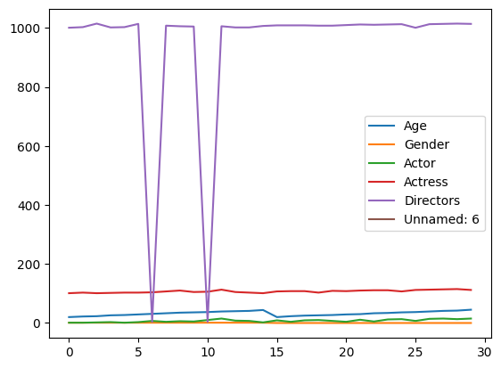

# Movie Genre Recomendation Machine Learning Model
## **Introduction**
A machine learning model is developed for recommendation of movie genre based on the data set obatined from the film reviews having attributes:
1. **Age** : Age of the film reviewer.
2. **Gender** : Gender of the data. reviewer.
3. **Actor** : Lead actor of the film.
4. **Actress** : Lead actress of the film.
5. **Director** : Director of the film.
---
## **How can you use this model ?**

1. Download and install [Anaconda](https://www.anaconda.com/products/distribution/installation-success) on your computer.
2. Type the command `conda install ipykernel` on the Anaconda Command propmt to install this package to work with jupyter notebooks in [Visual Studio Code Editor](https://code.visualstudio.com/).

    [Click here](https://youtu.be/h1sAzPojKMg) to refer to the tutorial.

3. Click on the `Fork` button to copy the files to your system. Now execute the files in your local system !

    [Click here](https://youtu.be/8lGpZkjnkt4) to refer to the tutorial.
---
## **Data Sets**
As mentioned in *Introduction* the data set consists of attibutes : **Age**,**Gender**,**Actor**,**Actress**,**Director**.
For the sake of simplificty of model all the actors, actresses and directors are assigned with distinct numerical codes. The codes of these attributes can be found in the *Data_Sets* File.

Fig : Data Visualization

---
## **Help Development**
You are welcome to submit pull requests, issues and more!

---
## **References and Resources**
---
1. [Anaconda](https://www.anaconda.com/products/distribution/installation-success).
2. [Visual Studio Code](https://code.visualstudio.com/)
3. [Python 3](https://www.python.org/download/releases/3.0/)
4. [Pandas Documentation](https://pandas.pydata.org/)
5. [Scikit-Learn Documentation](https://scikit-learn.org/stable/)
6. [MatPlotLib Documentation](https://matplotlib.org/stable/index.html)
7. [DecisionTreeClassifier Documentation](https://scikit-learn.org/stable/modules/generated/sklearn.tree.DecisionTreeClassifier.html)
8. [Machine Learning tutorial](https://youtu.be/_uQrJ0TkZlc)
---